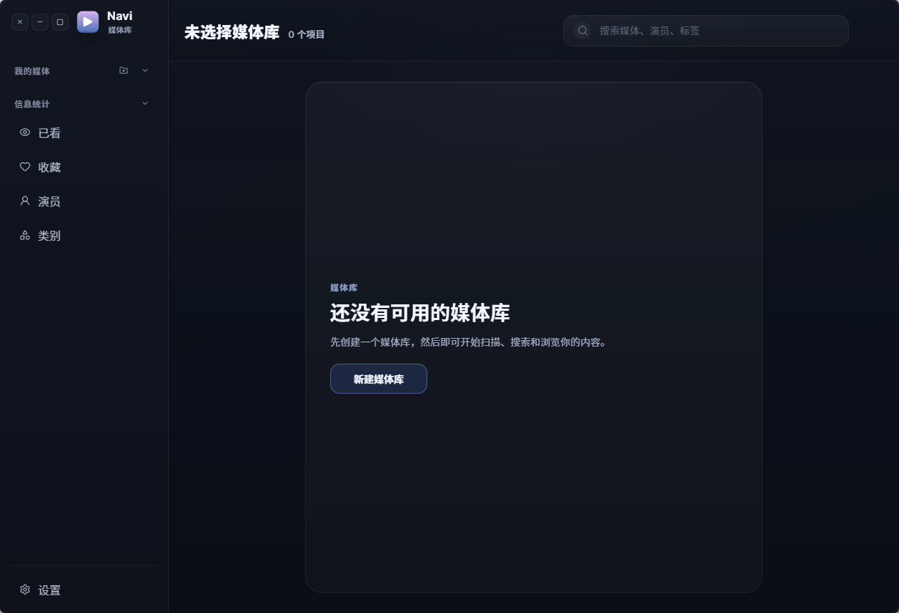

#  Navi Desktop

一个基于 `Go + Wails + React` 的本地媒体库桌面应用，重点解决本地影视资源的整理、扫描、浏览、播放和基础远程访问问题。

Navi 不是 Electron 套壳网页，而是用 Go 做桌面后端、React 做界面、SQLite 做本地数据存储的轻量级桌面程序，适合在 Windows 桌面环境中管理自己的本地媒体库。



## 功能概览

- 本地媒体库管理，支持创建多个媒体库和多个扫描目录
- 两种展示模式：海报视图、紧凑视图
- 自定义列表标题/副标题显示字段
- 媒体扫描支持三种模式：新增刷新、删改刷新、覆盖刷新
- 扫描时可读取本地 `NFO`、海报、背景图、字幕和视频元数据
- 支持 `.mkv`、`.mp4`、`.avi`、`.mov`、`.wmv`、`.flv`、`.webm`、`.m4v`、`.ts`、`.strm`
- 自动提取分辨率、编码、时长、字幕轨等媒体信息
- 收藏、已看、最近观看状态管理
- 演员、分类等聚合视图
- 随机播放、外部播放器打开、定位媒体目录
- 内置 `NFO` 编辑能力
- 媒体详情页推荐：继续观看 / 相似内容
- 可选开启 `Everything HTTP` 加速扫描
- 可选开启 Jellyfin 兼容 sidecar，供 Infuse / Jellyfin 客户端接入
- 本地 SQLite 存储，无需额外部署服务

## 适合谁用

- 想在 Windows 上维护自己的本地影视库
- 已经有规范文件夹、海报、`NFO`、字幕等资源，希望统一整理和浏览
- 需要一个比传统媒体管理工具更轻、更本地化的桌面前端
- 想把本地媒体库通过 Jellyfin 兼容接口给 Infuse 等客户端读取

## 核心能力

### 1. 媒体库管理

- 可创建多个媒体库，每个媒体库支持多个目录
- 库配置支持自定义视图模式、标题字段、副标题字段
- 支持编辑媒体库、删除媒体库、重新扫描媒体库

### 2. 扫描与索引

- `新增刷新`：只补新文件
- `删改刷新`：同步文件增删改
- `覆盖刷新`：清空当前库后重新入库
- 支持直接遍历文件系统扫描
- 启用 `Everything HTTP` 后，可用 Everything 的索引结果加速大目录扫描

### 3. 本地元数据与图片处理

- 优先读取本地 `NFO`
- 自动识别海报、背景图、预览图等 sidecar 文件
- 可在应用内直接编辑 `NFO`
- 对没有 `NFO` 且时长足够的视频，可自动生成海报、背景图和 `extrafanart` 预览图

### 4. 浏览与播放

- 海报流浏览
- 搜索媒体、演员、标签
- 收藏、标记已看
- 随机播放
- 使用系统默认播放器或指定外部播放器打开媒体
- 直接打开媒体所在文件夹

### 5. 远程访问

- 应用内可启动 Jellyfin 兼容 sidecar
- 可配置监听地址、端口、用户名、密码、服务器名称
- 适合在局域网内让 Infuse 或其他兼容客户端访问本地媒体库

## 安装教程

下面分为两种方式：

- 普通用户安装：直接运行现成可执行文件或 Release 包
- 开发者安装：从源码运行和构建

### 普通用户安装

#### 方式一：使用构建好的可执行文件

如果你已经拿到了构建产物，直接使用：

- `build/bin/Navi.exe`

推荐安装步骤：

1. 新建一个可写目录，例如 `D:\Apps\Navi` 或 `C:\Users\<你的用户名>\Apps\Navi`
2. 将 `Navi.exe` 放进去
3. 双击运行
4. 首次启动后，程序会在当前目录生成自己的运行文件

首次运行后常见文件：

- `navi.db`：本地数据库
- `settings.json`：桌面设置
- `remote_access.log`：远程访问日志
- `cache/`：缓存目录

重要说明：

- 这个项目默认把数据文件写在当前工作目录
- 不建议直接放到 `C:\Program Files\` 这类受限目录
- 更适合放在你自己有写权限的目录中运行

#### 方式二：从 GitHub Release 安装

如果后续仓库发布了 Release，可以按下面方式安装：

1. 打开仓库的 `Releases`
2. 下载对应系统的压缩包或安装包
3. 解压到一个可写目录
4. 运行主程序

### 开发者从源码安装

#### 1. 准备依赖

需要先安装：

- Go `1.23+`
- Node.js 与 npm
- Wails CLI

可参考下面命令安装 Wails CLI：

```bash
go install github.com/wailsapp/wails/v2/cmd/wails@latest
```

如果你在 Windows 上运行 Wails 应用，通常还需要系统具备 WebView2 Runtime。

#### 2. 克隆项目

```bash
git clone https://github.com/StarEllis/Navi-gui.git Navi
cd Navi
```

#### 3. 安装前端依赖

```bash
cd frontend
npm install
cd ..
```

#### 4. 启动开发模式

```bash
wails dev
```

#### 5. 构建桌面应用

```bash
wails build
```

构建产物默认会出现在：

- `build/bin/`

## 首次使用指南

### 1. 创建媒体库

启动应用后，先点击 `新建媒体库`，填写：

- 媒体库名称
- 一个或多个文件夹路径
- 视图模式
- 标题字段
- 副标题字段

### 2. 扫描媒体文件

创建媒体库后，点击顶部刷新按钮，按需选择：

- `新增刷新`
- `删改刷新`
- `覆盖刷新`

如果你的媒体目录较大，建议先从 `新增刷新` 开始。

### 3. 配置播放器

在 `设置` 页面中可以：

- 指定外部播放器路径
- 启用外部播放器播放
- 调整扫描相关选项
- 配置远程 sidecar

### 4. 浏览和操作媒体

扫描完成后，你可以：

- 搜索媒体、演员、标签
- 查看详情页
- 标记已看 / 收藏
- 编辑 NFO
- 随机播放
- 打开媒体目录

## 依赖说明

### FFmpeg / FFprobe

项目会使用 `ffprobe` 和 `ffmpeg` 做这些事情：

- 读取视频元数据
- 提取字幕轨信息
- 生成缩略图、海报、背景图、预览图

默认查找顺序如下：

1. 环境变量
2. `config/app.yaml`
3. `C:\ffmpeg\bin\ffprobe.exe` / `C:\ffmpeg\bin\ffmpeg.exe`
4. 系统 `PATH`

你可以通过以下环境变量覆盖默认值：

- `NAVI_FFPROBE_PATH`
- `NAVI_FFMPEG_PATH`

也可以编辑 [config/app.yaml](./config/app.yaml)：

```yaml
ffmpeg_path: C:\ffmpeg\bin\ffmpeg.exe
ffprobe_path: C:\ffmpeg\bin\ffprobe.exe
```

如果你不配置 FFmpeg，应用仍可运行，但部分媒体探测、缩略图和预览图功能会受影响。

### Everything HTTP

如果你希望加快大目录扫描速度，可以：

1. 安装 Everything
2. 开启 Everything HTTP Server
3. 在应用设置中启用 `调用 Everything`
4. 填写地址，例如 `http://127.0.0.1:8077`

### Jellyfin 兼容 Sidecar

如果你想让 Infuse 或其他客户端访问 Navi 的媒体库：

1. 打开应用 `设置`
2. 进入远程访问相关配置
3. 启用 `Jellyfin Sidecar`
4. 设置监听地址、端口、用户名、密码、服务器名称
5. 在客户端中添加 Jellyfin 服务器

默认端口：

- `18096`

局域网使用时请注意：

- 如果监听地址填的是 `0.0.0.0`，客户端里不要写 `0.0.0.0`
- 应该填写这台机器在局域网中的真实 IP，例如 `192.168.x.x`

## 开发命令

### 安装依赖

```bash
cd frontend
npm install
```

### 本地开发

```bash
wails dev
```

### 生产构建

```bash
wails build
```

### 运行 Go 测试

```bash
go test ./...
```

## 项目结构

```text
Navi/
├─ app.go                      # Wails 后端主逻辑，向前端暴露应用能力
├─ main.go                     # Wails 应用入口
├─ remote_access.go            # Jellyfin 兼容 sidecar
├─ config/                     # 应用、缓存、数据库、FFmpeg 配置
├─ model/                      # 数据模型
├─ repository/                 # 数据访问层
├─ service/                    # 扫描、NFO、推荐、缩略图等核心服务
├─ frontend/                   # React + TypeScript 前端
│  ├─ src/components/          # 页面组件
│  ├─ src/utils/               # 前端缓存、搜索、媒体工具
│  └─ wailsjs/                 # Wails 自动生成的绑定代码
├─ build/                      # 构建输出和安装器相关文件
├─ assets/                     # README 资源和静态图片
├─ navi.db                     # 本地 SQLite 数据库（运行后生成/更新）
└─ settings.json               # 本地设置文件（运行后生成/更新）
```

## 技术栈

- Go
- Wails v2
- React 18
- TypeScript
- Vite
- SQLite
- GORM
- Zap

## 常见问题

### 1. 双击程序后打不开

可以优先检查：

- 是否缺少 WebView2 Runtime
- 是否在只读目录运行程序
- 是否被安全软件拦截

### 2. 扫描不到媒体

检查以下项目：

- 媒体库路径是否填写正确
- 视频文件扩展名是否受支持
- 是否真的执行过扫描
- 是否误用了空目录或无权限目录

### 3. 没有生成预览图

预览图依赖 `ffmpeg/ffprobe`，并且只会在满足条件时生成，例如：

- 已启用视频缩略图功能
- 媒体是电影类视频
- 视频时长大于最小时长阈值
- 当前目录下没有对应 `NFO`

### 4. 远程客户端连不上

优先检查：

- 监听端口是否被占用
- 用户名和密码是否已填写
- 客户端使用的是否是本机真实局域网 IP
- 防火墙是否放行对应端口

## 当前状态

这是一个已经具备本地媒体库管理主流程的桌面项目，核心能力包括：

- 本地库管理
- 扫描与索引
- NFO 读写
- 媒体详情与推荐
- Jellyfin 兼容远程访问

如果你要继续完善它，下一步比较值得投入的方向通常是：

- Release 打包与安装器整理
- README 中英文双语化
- 自动化测试扩充
- 发布流程和版本管理

## License

当前仓库里未看到明确的 `LICENSE` 文件。

如果你准备公开发布到 GitHub，建议尽快补充许可证文件，例如 `MIT`、`Apache-2.0` 或你自己的授权协议。
